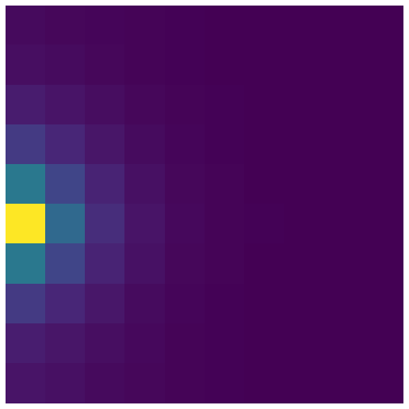

# graph-structure-of-auditory-cortex

Project using a novel machine learning algorithm based on a graph neural network architecture to interrogate the correlation structure and organising principles of the auditory cortex.

